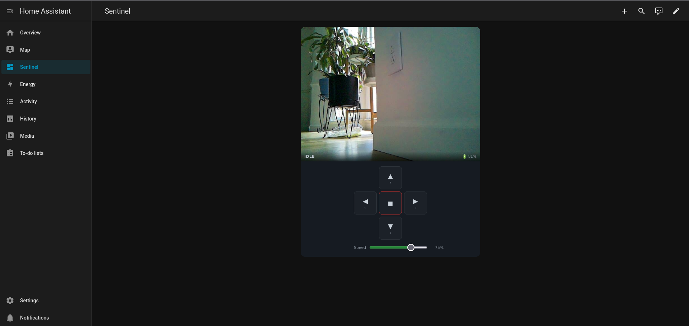

# Sentinel — Home Sentry Bot

A tracked robot controlled via Home Assistant or a local web app, served by a Raspberry Pi Zero 2 W. Two DC motors driven by an L298N H-bridge, live MJPEG camera stream via Pi Camera with pan-tilt from an ArduCam PCA9685 kit, battery powered by PiSugar 3.

---

## Parts List

| Part | Link |
|------|------|
| Raspberry Pi Zero 2 W | [Amazon](https://amzn.to/4rDZCXC) |
| Tracked robot chassis | [Amazon](https://amzn.to/47b2CUe) |
| L298N motor driver | [Amazon](https://amzn.to/3PdudOx) |
| PiSugar 3 battery | [Amazon](https://amzn.to/4sfucrL) |
| ArduCam pan-tilt platform (PCA9685) | [Amazon](https://amzn.to/4cUB5dt) |
| ArduCam camera module | [Amazon](https://amzn.to/40EPqDu) |
| ArduCam 30 cm ribbon cable | [Amazon](https://amzn.to/41f3Nyq) |
| Female-to-female breadboard jumpers | [Amazon](https://amzn.to/40IowdR) |

---

## Hardware

| Component | Details |
|-----------|---------|
| Compute | Raspberry Pi Zero 2 W |
| OS | Raspberry Pi OS Lite 64-bit (Trixie) |
| Motors | 2× DC motors (tracked chassis) |
| Motor driver | L298N H-bridge |
| Camera | Pi Camera v1 (OV5647) |
| Pan-tilt | ArduCam pan-tilt kit SKU B0283 (PCA9685 16-ch PWM controller) |
| Battery | PiSugar 3 |

---

## Wiring

### L298N → Raspberry Pi Zero 2 W

| L298N Pin | BCM GPIO | Physical Pin | Function |
|-----------|----------|--------------|----------|
| IN1 | GPIO 23 | Pin 16 | Right motor direction A |
| IN2 | GPIO 22 | Pin 15 | Right motor direction B |
| ENA | GPIO 18 | Pin 12 | Right motor PWM (speed) |
| IN3 | GPIO 17 | Pin 11 | Left motor direction A |
| IN4 | GPIO 27 | Pin 13 | Left motor direction B |
| ENB | GPIO 19 | Pin 35 | Left motor PWM (speed) |
| GND | GND | Pin 6 | Shared ground |

### L298N Motor Outputs

| L298N Output | Motor |
|--------------|-------|
| OUT1 / OUT2 | Right motor |
| OUT3 / OUT4 | Left motor |

> **Power**: Motor battery pack connects to the L298N VCC and GND screw terminals. Never power motors from the Pi 5V rail.
>
> **ENA/ENB**: Remove the jumper caps and wire to Pi GPIO for PWM speed control. Leave jumpers on for always-on full speed.
>
> **Ground**: Pi GND (pin 6) must be connected to L298N GND, otherwise GPIO signals have no reference and the motors will not respond.

### ArduCam pan-tilt kit (PCA9685) → Raspberry Pi Zero 2 W

| PCA9685 Wire | Physical Pin | Function |
|--------------|--------------|----------|
| VCC | Pin 4 | 5 V |
| GND | Pin 6 | GND |
| SDA | Pin 3 | GPIO 2 (I2C SDA) |
| SCL | Pin 5 | GPIO 3 (I2C SCL) |

| PCA9685 Channel | Servo |
|-----------------|-------|
| Channel 0 | Tilt servo (up / down) |
| Channel 1 | Pan servo (left / right) |

> **I2C address**: 0x40 (PCA9685 default). Configured in `config.toml` under `[camera_control]`.

---

## Software Setup

### First-time Pi setup

Flash **Raspberry Pi OS Lite 64-bit** to a microSD card using Raspberry Pi Imager. See [`docs/first-boot.md`](docs/first-boot.md) for headless WiFi/SSH configuration.

After SSH-ing into the Pi:

```bash
git clone https://github.com/arudyk/sentinel.git
cd sentinel
bash setup.sh
```

`setup.sh` will:
1. Install system packages (`picamera2`, `RPi.GPIO`, `python3-smbus2`, `i2c-tools`)
2. Enable I2C in `/boot/firmware/config.txt` (required for pan-tilt)
3. Install and start `pisugar-server` for battery monitoring
4. Create a Python virtualenv with `--system-site-packages`
5. Install Flask
6. Install and enable the `sentinel` systemd service

### Accessing the web UI

| Method | URL |
|--------|-----|
| Local network | `http://192.168.1.138:8080` |
| mDNS hostname | `http://sentinel.local:8080` |

For remote access, use the [Home Assistant integration](ha-integration/) — the HA camera proxy and controls work from anywhere HA is reachable.

### Deploying updates

From your dev machine (pushes to GitHub then pulls on the Pi):

```bash
bash deploy.sh
```

Override the target with env vars if needed:

```bash
SENTINEL_HOST=192.168.1.138 SENTINEL_USER=sentinel bash deploy.sh
```

### Managing the service

```bash
sudo systemctl status sentinel       # check status
sudo systemctl restart sentinel      # restart
sudo journalctl -u sentinel -f       # follow logs
```

---

## Development (no Pi required)

```bash
python3 -m venv venv && source venv/bin/activate
pip install -r requirements.txt
python -m sentinel.main
# Open http://localhost:8080
```

GPIO falls back to dry-run mode (logs pin changes to stdout). Camera falls back to a placeholder JPEG frame. All routes and controls work normally.

```bash
python -m pytest tests/ -v    # run unit tests
```

---

## Configuration

All tunable parameters live in `config.toml`. Edit and restart the service to apply changes.

```toml
[motor]
in1 = 23           # Right motor dir A — BCM GPIO number
in2 = 22           # Right motor dir B — BCM GPIO number
ena = 18           # Right motor PWM   — BCM GPIO number
in3 = 17           # Left motor dir A  — BCM GPIO number
in4 = 27           # Left motor dir B  — BCM GPIO number
enb = 19           # Left motor PWM    — BCM GPIO number
default_speed = 75  # 0–100
pwm_frequency = 1000

[camera]
width = 640
height = 480
framerate = 15
jpeg_quality = 70
rotation = 180      # 0, 90, 180, or 270

[camera_control]
i2c_bus  = 1
i2c_addr = 64       # 0x40 — PCA9685 default

[server]
host = "0.0.0.0"
port = 8080
debug = false
```

> **Pin numbers**: values are BCM GPIO numbers, not physical pin numbers. Use the wiring table above to cross-reference.

---

## Controls

### Drive — keyboard

| Key | Action |
|-----|--------|
| `↑` | Forward |
| `↓` | Reverse |
| `←` | Turn left |
| `→` | Turn right |
| `Space` | Stop |

Hold the key to keep moving — releasing stops the robot.

### Drive — mobile

Use the on-screen D-pad. Touch and hold to move, release to stop.

### Speed

Adjust the speed slider (0–100%) before or during movement.

### Camera pan-tilt — keyboard

| Key | Action |
|-----|--------|
| `I` | Tilt up |
| `K` | Tilt down |
| `J` | Pan left |
| `L` | Pan right |

Hold to move continuously; release to stop at the current position.

### Camera pan-tilt — mobile

Tap and hold the transparent arrow buttons overlaid on the camera stream.

---

## HTTP API

| Method | Route | Description |
|--------|-------|-------------|
| `GET` | `/` | Web UI |
| `GET` | `/stream` | MJPEG live camera stream |
| `POST` | `/command` | Send a drive command |
| `POST` | `/pan_tilt` | Set camera pan and/or tilt angle |
| `GET` | `/status` | Current state (JSON) |

### POST /command

```bash
curl -X POST http://sentinel.local:8080/command \
  -H "Content-Type: application/json" \
  -d '{"action": "forward", "speed": 75}'
```

Valid actions: `forward`, `reverse`, `turn_left`, `turn_right`, `stop`, `brake`

### POST /pan_tilt

```bash
curl -X POST http://sentinel.local:8080/pan_tilt \
  -H "Content-Type: application/json" \
  -d '{"pan": 90, "tilt": 60}'
```

Both fields are optional — send only `pan` or only `tilt` to move one axis. Angles are 0–180°, center is 90°.

### GET /status

```json
{
  "action": "forward",
  "speed": 75,
  "camera_ok": true,
  "pan": 90,
  "tilt": 90,
  "uptime_s": 120,
  "battery_pct": 85.0,
  "battery_v": 4.05,
  "battery_plugged": false,
  "battery_charging": false
}
```

---

## Home Assistant Integration

The `ha-integration/` directory contains a custom HA integration that exposes Sentinel as a first-class Home Assistant device. This is the recommended way to control the robot remotely — all traffic is proxied through HA so no direct network access to the Pi is required.



### What it provides

| Entity | Description |
|--------|-------------|
| `camera.sentinel_camera` | Live MJPEG stream (proxied through HA) |
| `button.sentinel_forward/reverse/turn_left/turn_right` | Drive commands |
| `button.sentinel_stop` / `button.sentinel_brake` | Stop / active brake |
| `number.sentinel_speed` | Speed setting (0–100 %) |
| `number.sentinel_pan` | Camera pan angle (0–180°) |
| `number.sentinel_tilt` | Camera tilt angle (0–180°) |
| `sensor.sentinel_battery` | Battery percentage |
| `sensor.sentinel_battery_voltage` | Battery voltage (V) |
| `sensor.sentinel_speed` | Current motor speed |
| `sensor.sentinel_uptime` | Pi uptime (seconds) |
| `binary_sensor.sentinel_camera` | Camera health |
| `binary_sensor.sentinel_plugged_in` | External power connected |
| `binary_sensor.sentinel_charging` | Battery charging |

### Installation

1. Copy `ha-integration/custom_components/sentinel/` into your HA `config/custom_components/` directory.
2. Copy `ha-integration/www/sentinel-card.js` into your HA `config/www/` directory.
3. Restart Home Assistant.
4. Go to **Settings → Devices & Services → Add Integration**, search for **Sentinel**.
5. Enter the robot's IP address and port (default `8080`).

### Lovelace card

Add the Sentinel card to any dashboard with:

```yaml
type: custom:sentinel-card
entity_prefix: sentinel   # default, omit if unchanged
```

The card shows the live camera feed, a D-pad for driving, a speed slider, and transparent pan-tilt arrows overlaid on the camera stream. Controls:

| Input | Action |
|-------|--------|
| Arrow keys | Drive (↑ forward, ↓ reverse, ← / → turn) |
| `Space` | Stop |
| `I` / `K` / `J` / `L` | Tilt up / down / pan left / right |
| D-pad buttons | Touch / click and hold to drive, release to stop |
| Camera overlay arrows | Touch / click and hold to pan-tilt, release to stop |

### Requirements

- Sentinel must be reachable from the HA host on the local network.
- The `www/` resource must be registered in HA. Go to **Settings → Dashboards → Resources → Add resource**, set URL to `/local/sentinel-card.js` and type to **JavaScript module**.

---

## Project Structure

```
sentinel/
├── config.toml                 Central configuration (GPIO pins, camera, server)
├── requirements.txt            Python dependencies (Flask only)
├── setup.sh                    One-shot Pi setup script
├── deploy.sh                   Deploy to robot (git push + pull on Pi + restart)
│
├── sentinel/                   Python package
│   ├── main.py                 Flask app and route definitions
│   ├── motor_controller.py     L298N GPIO/PWM driver
│   ├── camera_stream.py        picamera2 MJPEG streaming
│   ├── camera_control.py       PCA9685 pan-tilt servo driver (I2C via smbus2)
│   ├── battery_monitor.py      PiSugar 3 battery reader
│   └── config.py               Loads config.toml into dataclasses
│
├── web/                        Frontend (no build step)
│   ├── index.html
│   ├── style.css
│   └── app.js
│
├── systemd/
│   └── sentinel.service        Systemd unit file
│
├── tests/
│   ├── test_motor_controller.py
│   └── test_config.py
│
└── docs/
    ├── wiring.md               Detailed wiring reference
    └── first-boot.md           SD card and headless setup
```
